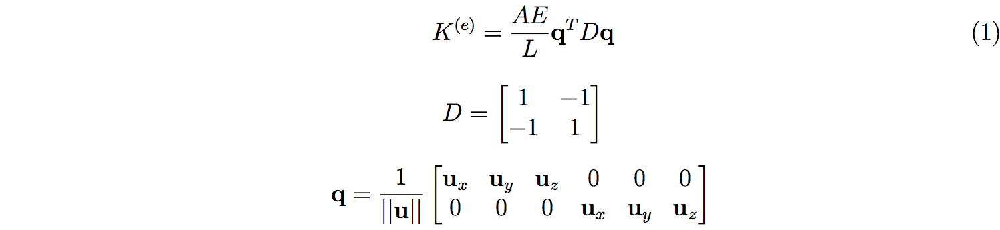

# Space-Truss
The algorithm is based on D. Hutton's Fundamentals of Finite Element Analysis. 

This library uses Jama (https://math.nist.gov/javanumerics/jama/) as the linear solver, however, the user may use other Java solver instead by modifying the source file.

## 1. Input
double[][] nodes;  //  nodes[2] ={10.2, 2, 7.5} represents the x-y-z coordinates the 3rd node. 

int[][] members;   //  members[2] ={6,8} means the 3rd member links 7th node to 9th node. The start node’s index muse be smaller the end node’s.

double[][] loads;  // loads on each node. Distributed loads must be transformed to nodal loads.

double[] Es; // Young's modulus

double[] As; // cross-sectional area

boolean[][] constrained;    //constrained[2]={false, true, false} means the 3rd node is constrained along y-axis.

## 2. Solver options
The algorithm solves a matrix equation Ku=F, where K is the stiffness matrix, u denotes the nodal displacements, and F is the nodal loads.

This library uses Jama to solve the equation: UA = M.solve_square_Axb(KAA, FA), see SpaceTruss.construct_matrices(). 

One might replace this method using other linear solvers for better performances: 1. https://ujmp.org, or 2.https://github.com/fommil/matrix-toolkits-java (very fast). 

## 3. Ouput

int lenA;  //the number of unconstrained nodal displacements.

String[] symbols; //the notations of unconstrained nodal displacements, symbols[4]=“u2y” means that UA’s 5th element is the y-axis displacement of the 3rd node.

double[] UA;  //(unconstrained) nodal displacements arranged in a vector: ux1, uy1,uz1, ux2, uy2,uz2,…

double[] member_force;//member compression/tension arranged in a vector: fx1, fy1,fz1, fx2, fy2,fz2,…

## 4. Stiffness matrix of member e

where u denotes the direction vector of member e.